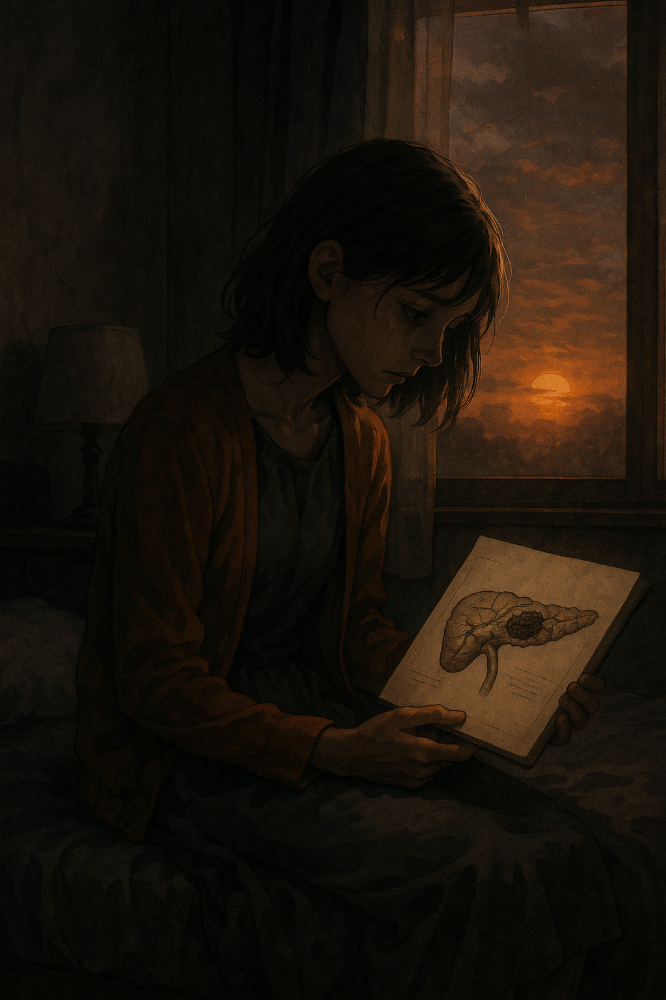

# Let Me Eat Your Pancreas

 [Mr.Children’s “Himawari”](https://youtu.be/Ru2k4pRT8WE?si=vVC5oCmQu2BRDTQY) is the theme song of the film I Want to Eat Your Pancreas. It delicately captures the complex emotions of Haruki, the protagonist, as he faces the impending farewell with Sakura. The song is especially impactful in the scene where Haruki, after Sakura's death, comes to understand her true feelings through a letter she left behind—leaving a lasting impression on the audience. Musically, the song begins with a gentle piano and string arrangement, gradually building in intensity with the addition of drums and guitar in the latter half, mirroring the emotional crescendo. The subtle yet expressive vocals are also key to conveying the sincerity of the song's message. One of the most striking lyrics is: “暗がりで咲いてるひまわり”(“A sunflower blooming in the darkness”) This line draws a comparison between the protagonist's journey of growth after bidding farewell to Sakura, a symbol of spring, and a sunflower.

나는 내 장례식에서 AKMU의 [작별인사](https://youtu.be/5yIzrpxCFJY?si=ucSMgUtjnp6Efj-G)가 연주되면 좋겠다. 내가 AKMU의 노래를 정말 좋아하는 데다가, 음악의 분위기가 편안하고 가사도 의미있는 인사가 되어주기 때문이다. 사실 [장례희망](https://youtu.be/iIn_1_XDuBM?si=NLBanjR4sP5NBtGs)도 정말 좋은 노래이지만, 특정 종교적 색채가 강해 내 장례식에는 적합하지 않을 수 있다고 생각했다. 난 내 장례식이 특정한 색채를 크게 가지지 않고 사람들이 편안하게 직별을 맞이하는 장이 되었으면 한다.

Example: The similar disease is described in Josh Boone's 2014 film [*The Fault in Our Stars*](lee_minji.md). The film Ed Sheeran's hit song "All of the Stars"

